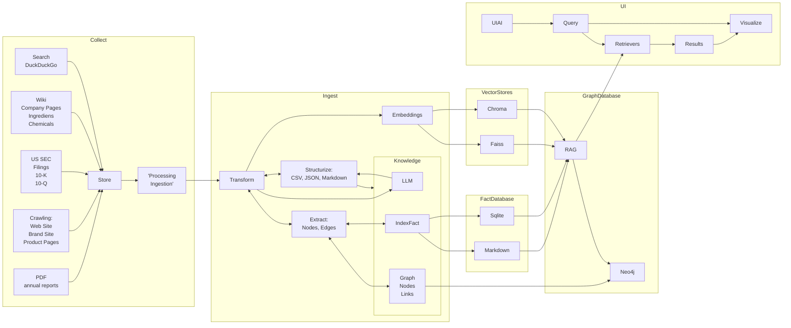

# KnopenKoning
Master your supply chain, untangling every challenge.


## Installation
```bash

python -m venv .venv    

#windows
.venv\Scripts\activate  

# linux
source .venv/bin/activate


python -m pip install -r requirements.txt
``` 


## Building the rag index
```bash
python build_rag.py
python build_knowledge.py
```


## Running the app
```bash
python backend/main.py
```




### Welke Leverenciers leveren nou aan wie? Supplychain map.
### Een entiteit als node pakken, dat betekend unilever aanzich ook al een entiteit is. 
### Formele juridische leverancier, maar je hebt ook de phyzieke leverancier. De administratie en de financiele stroom hoeft niet dezelfde mapping te hoeven zijn, een andere lens die je erover legt, kijk je naar de goederenstroom of de financiele stroom, dat maakt ook uit. 
### We hebben het over producten maar je kan het ook hebben over merknamen dat kan ook nog eens zien wat het is over unilever. 
### je kan het zien als een groep van entiteiten maar je kan het ook zien als een groep van... merkennamen, lipton, ola. Dus als je gaat zoeken, dan kan je daarop zoeken, ook de leveranciers van de merknamen. Switch to Scania.

