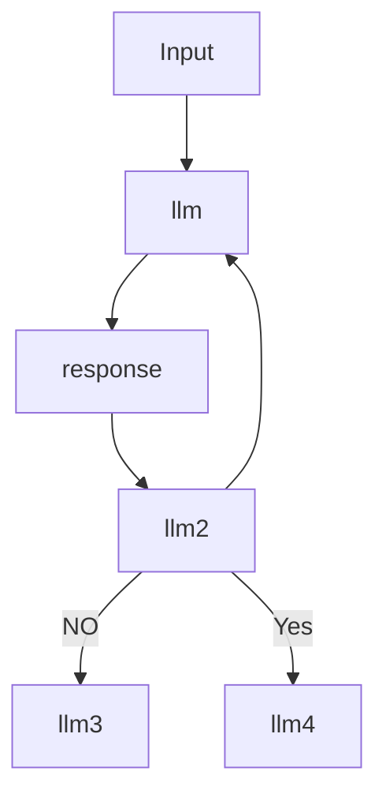
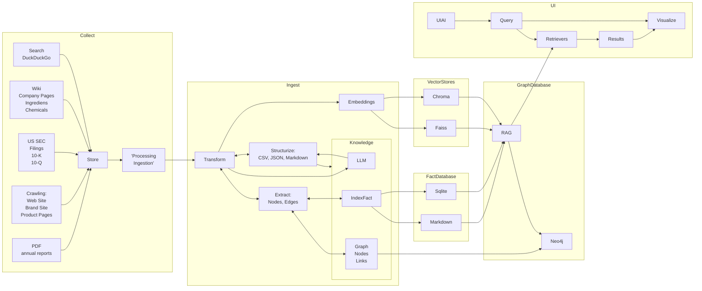
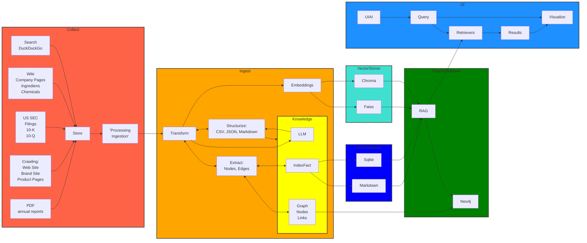

# KnopenKoning
Master your supply chain, untangling every challenge.

## Documetation 

 - Install quarto from [Quarto](https://quarto.org/docs/download/)
 ```bash
    quarto install tinytex
    quarto render docs --format pdf
 ```

# Docker installation
docker buildx build -f ./Dockerfile.Frontend    -t vch_frontend:latest .
docker buildx build -f ./Dockerfile.Backend     -t vch_backend:latest . 

Will be exposed on port 3000;

if you use traefic, use the docker-compose.traefic


## Installation

Install python from [Python](https://www.python.org/downloads/)
Install node from [Node](https://nodejs.org/en/download/)
Install mongodb from [MongoDB](https://www.mongodb.com/try/download/community)
Install mysql from [MySQL](https://dev.mysql.com/downloads/installer/)

Check and update .env file with the correct database connection strings and urls.

```bash

### backend requirements
```bash
python -m venv .venv    

#windows
.venv\Scripts\activate  

# linux
source .venv/bin/activate

python -m pip install -r requirements.txt

# create the mysql database
python create_db.py

``` 

### frontend requirements

```bash
cd tsfrontend
npm install
```


## Running the app
```bash
python backend/main.py
```








Current Status





### Welke Leverenciers leveren nou aan wie? Supplychain map.
### Een entiteit als node pakken, dat betekend unilever aanzich ook al een entiteit is. 
### Formele juridische leverancier, maar je hebt ook de phyzieke leverancier. De administratie en de financiele stroom hoeft niet dezelfde mapping te hoeven zijn, een andere lens die je erover legt, kijk je naar de goederenstroom of de financiele stroom, dat maakt ook uit. 
### We hebben het over producten maar je kan het ook hebben over merknamen dat kan ook nog eens zien wat het is over unilever. 
### je kan het zien als een groep van entiteiten maar je kan het ook zien als een groep van... merkennamen, lipton, ola. Dus als je gaat zoeken, dan kan je daarop zoeken, ook de leveranciers van de merknamen. Switch to Scania.

