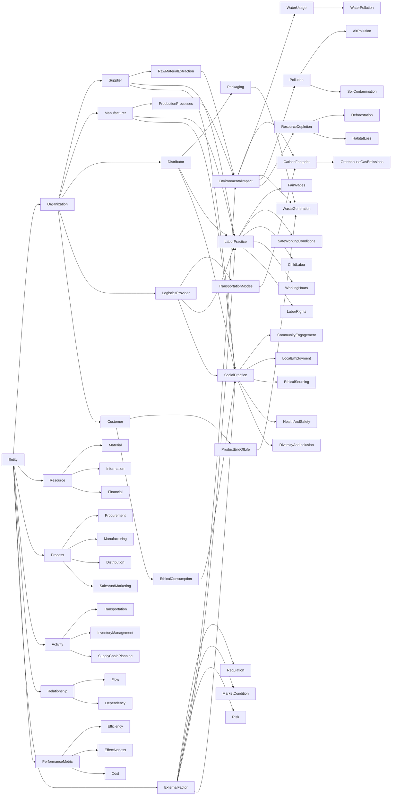

```mermaid
graph LR
    Entity --> Organization
    Entity --> Resource
    Entity --> Process
    Entity --> Activity
    Entity --> Relationship
    Entity --> PerformanceMetric
    Entity --> ExternalFactor

    Organization --> Supplier
    Organization --> Manufacturer
    Organization --> Distributor
    Organization --> LogisticsProvider
    Organization --> Customer

    Resource --> Material
    Resource --> Information
    Resource --> Financial

    Process --> Procurement
    Process --> Manufacturing
    Process --> Distribution
    Process --> SalesAndMarketing

    Activity --> Transportation
    Activity --> InventoryManagement
    Activity --> SupplyChainPlanning

    Relationship --> Flow
    Relationship --> Dependency

    PerformanceMetric --> Efficiency
    PerformanceMetric --> Effectiveness
    PerformanceMetric --> Cost

    ExternalFactor --> Regulation
    ExternalFactor --> MarketCondition
    ExternalFactor --> Risk
    ExternalFactor --> EnvironmentalImpact
    ExternalFactor --> LaborPractice
    ExternalFactor --> SocialPractice

    EnvironmentalImpact --> CarbonFootprint
    EnvironmentalImpact --> WaterUsage
    EnvironmentalImpact --> WasteGeneration
    EnvironmentalImpact --> Pollution
    EnvironmentalImpact --> ResourceDepletion

    CarbonFootprint --> GreenhouseGasEmissions
    WaterUsage --> WaterPollution
    Pollution --> AirPollution
    Pollution --> SoilContamination
    ResourceDepletion --> Deforestation
    ResourceDepletion --> HabitatLoss

    Supplier --> RawMaterialExtraction
    RawMaterialExtraction --> EnvironmentalImpact

    Manufacturer --> ProductionProcesses
    ProductionProcesses --> EnvironmentalImpact

    Distributor --> Packaging
    Packaging --> WasteGeneration

    LogisticsProvider --> TransportationModes
    TransportationModes --> CarbonFootprint

    Customer --> ProductEndOfLife
    ProductEndOfLife --> WasteGeneration

    LaborPractice --> FairWages
    LaborPractice --> SafeWorkingConditions
    LaborPractice --> ChildLabor
    LaborPractice --> WorkingHours
    LaborPractice --> LaborRights

    SocialPractice --> CommunityEngagement
    SocialPractice --> LocalEmployment
    SocialPractice --> EthicalSourcing
    SocialPractice --> HealthAndSafety
    SocialPractice --> DiversityAndInclusion

    Supplier --> LaborPractice
    Supplier --> SocialPractice

    Manufacturer --> LaborPractice
    Manufacturer --> SocialPractice

    Distributor --> LaborPractice
    Distributor --> SocialPractice

    LogisticsProvider --> LaborPractice
    LogisticsProvider --> SocialPractice

    Customer --> EthicalConsumption
    EthicalConsumption --> SocialPractice

```