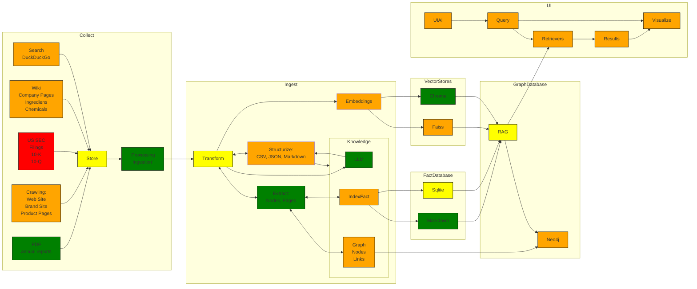

```mermaid
graph LR


style PDF fill:#008000, stroke:#000000
style Crawling fill:#ffa500, stroke:#000000
style SEC fill:#ff0000, stroke:#000000
style Wikipedia fill:#ffa500, stroke:#000000
style DuckDuckGo fill:#ffa500, stroke:#000000
style Store fill:#ffff00, stroke:#000000
style Ingestion fill:#008000, stroke:#000000
style Transform fill:#ffff00, stroke:#000000
style Extract fill:#008000, stroke:#000000
style LLM fill:#008000, stroke:#000000
style IndexGraph fill:#ffa500, stroke:#000000
style IndexFact fill:#ffa500, stroke:#000000
style Neo4j fill:#ffa500, stroke:#000000
style Sqlite fill:#ffff00, stroke:#000000
style Markdown fill:#008000, stroke:#000000
style Faiss fill:#ffa500, stroke:#000000
style Chroma fill:#008000, stroke:#000000
style RAG fill:#ffff00, stroke:#000000
style UIAI fill:#ffa500, stroke:#000000
style Query fill:#ffa500, stroke:#000000
style Retrievers fill:#ffa500, stroke:#000000
style Results fill:#ffa500, stroke:#000000
style Visualize fill:#ffa500, stroke:#000000
style Embeddings fill:#ffa500
style Structurize fill:#ffa500

subgraph Collect
PDF[PDF\nannual reports] --> Store
Crawling[
    Crawling:\nWeb Site\nBrand Site\nProduct Pages
] --> Store
SEC[
    US SEC\nFilings\n10<wbr>-K\n10-Q
] --> Store
Wikipedia[Wiki\n<wbr>Company Pages\nIngredien<wbr>s\nChemicals] --> Store

DuckDuckGo[Searc<wbr>h\nDuckDuckGo] --> Store

Store --> Ingestion['Proce<wbr>ssing\nIngestion<wbr>']
end
subgraph Ingest
    Ingestion --> Transform <--> Extract[Extract:<wbr>\n Nodes, Edges]
    Transform <--> Structurize[Stru<wbr>cturize:\n CSV, JSON, Markdown]
    Transform --> Embeddings
    Structurize --> Knowledge
end
subgraph Knowledge
    Transform --> LLM
    Extract <--> IndexGraph
    Extract <--> IndexFact
    LLM --> Structurize
end
RAG --> Retrievers
subgraph GraphDatabase
    IndexGraph[Graph<wbr>\nNodes\nLinks] --> Neo4j 
    RAG --> Neo4j
end
subgraph FactDatabase
    IndexFact --> Sqlite 
    IndexFact --> Markdown
    Markdown --> RAG
    Sqlite --> RAG
end

subgraph VectorStores
    Embeddings --> Faiss
    Embeddings --> Chroma
    Faiss --> RAG
    Chroma --> RAG
end

subgraph UI
    UIAI --> Query --> Retrievers --> Results --> Visualize
    Query --> Visualize
end

```
